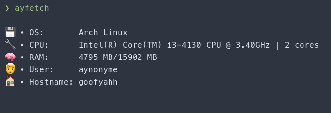

# ayfetch 😃

ayfetch is a simple fetch with emojis. 😃

 

## Build instructions

First, clone the repo
```bash
git clone https://github.com/AYn0nyme/ayfetch
```
Go into the directory
```bash
cd ayfetch
```
Then, build
```bash
go build
```
And finally, you can run it
```bash
./ayfetch
```
